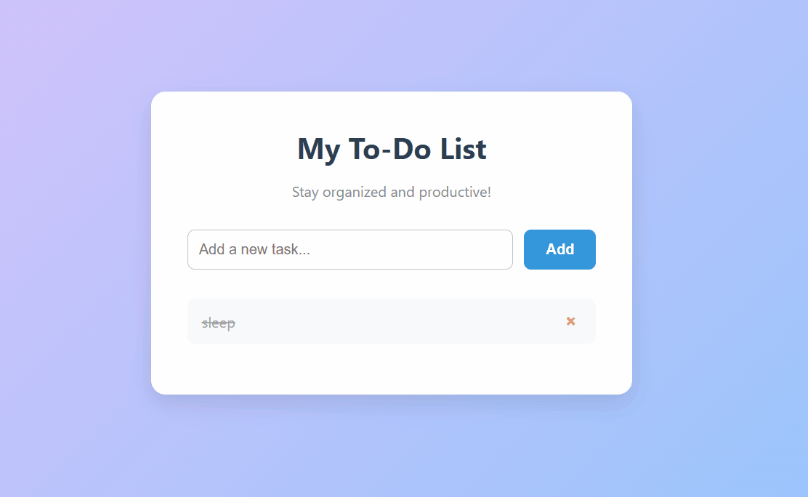

# TO-DO-APP
"A simple, clean, and modern to-do list web application built with HTML, CSS, and vanilla JavaScript to help you stay organized."
Stylish To-Do List App
A simple, clean, and modern to-do list web application built with HTML, CSS, and vanilla JavaScript. This project helps you keep track of your tasks in a beautiful and intuitive interface.

Features
Add Tasks: Quickly add new tasks to your list.
Mark as Complete: Click on a task to mark it as completed with a satisfying strikethrough effect.

Delete Tasks: Remove tasks you no longer need.

Responsive Design: The app is designed to look great on all devices, from desktops to mobile phones.

Modern UI: A clean, minimalist design with a pleasant gradient background and smooth transitions.

Technologies Used
This project was built using fundamental web technologies:

HTML5: For the structure and content of the application.

CSS3: For all the styling, including the layout, gradient background, and animations.

Vanilla JavaScript: For the application's logic and interactivity, without relying on any external libraries or frameworks.

How to Use
To get this project running on your local machine, simply follow these steps:

Clone the repository (or download the files):

Navigate to the project directory:

cd your-repository-name

Open the index.html file in your web browser.

That's it! You can now start adding and managing your tasks.

File Structure
The project is organized into three main files:

index.html: Contains the main HTML structure of the to-do list.

style.css: Contains all the CSS rules for styling the application.

app.js: Contains all the JavaScript code that handles the application's functionality, such as adding, deleting, and completing task

